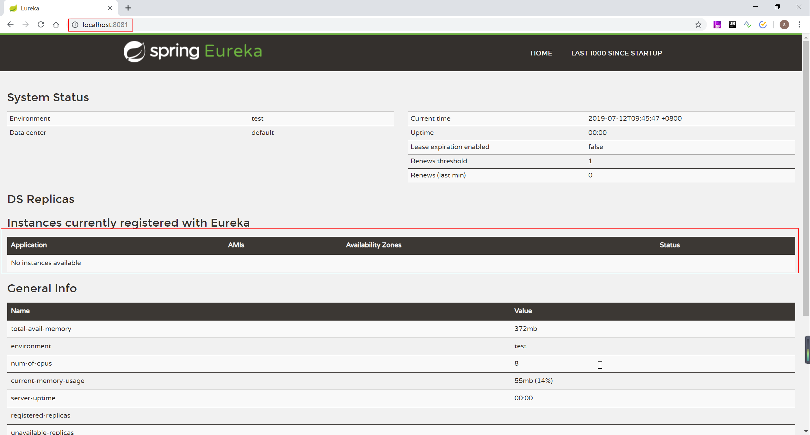
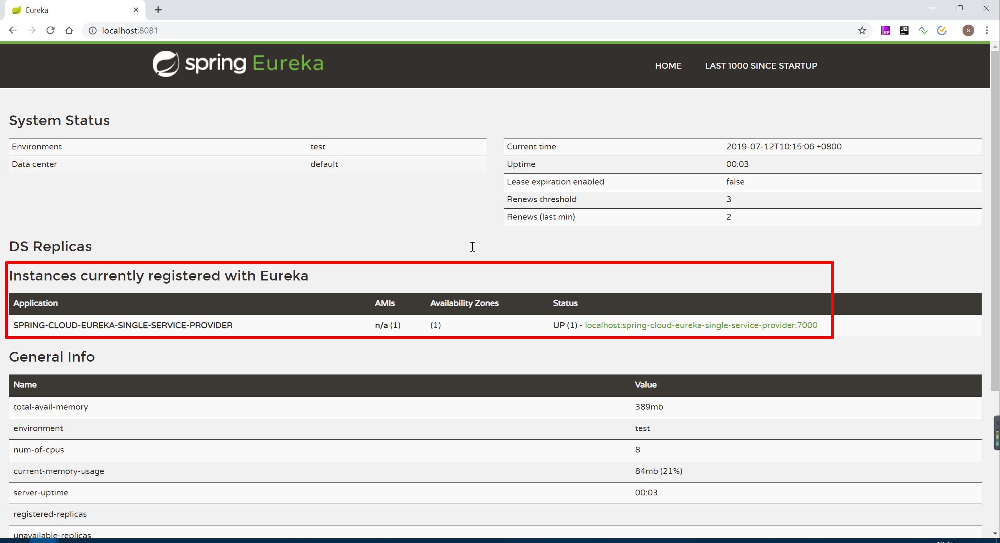
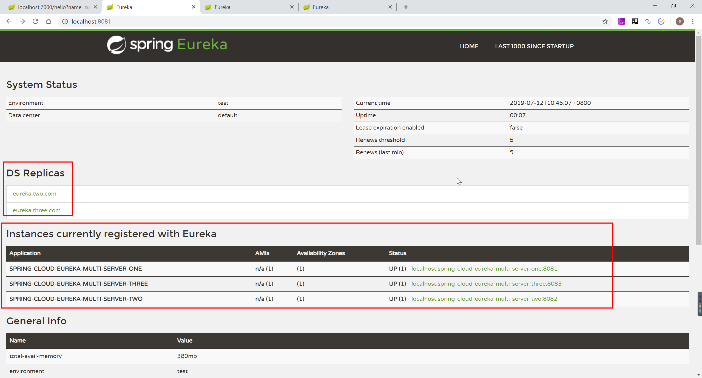
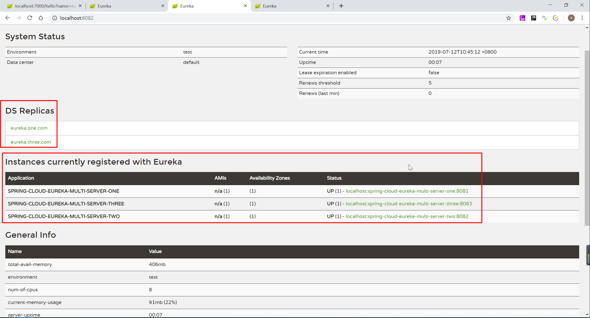
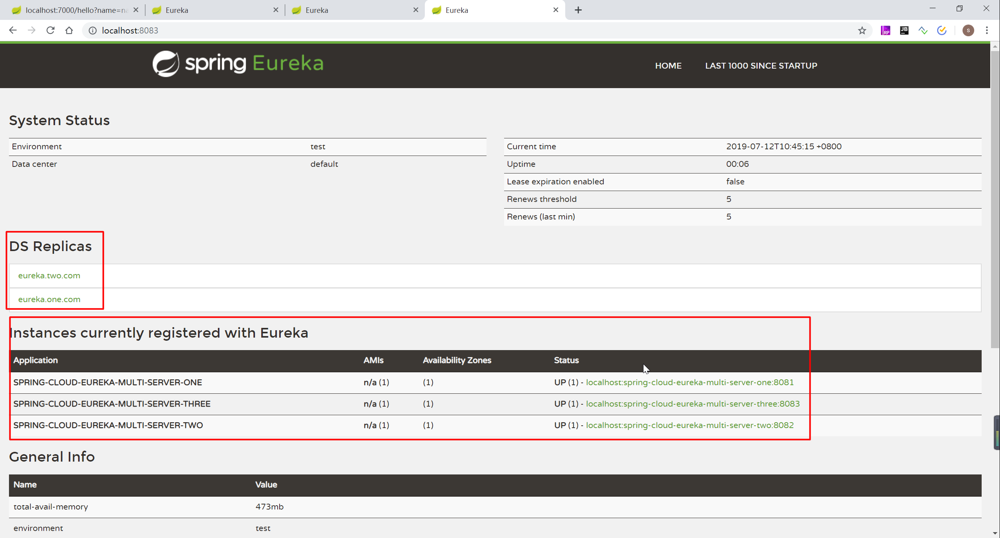

# SpringCloud 学习笔记之注册与发现

## 基础架构

* 服务注册中心：Eureka 提供的服务端，提供服务注册与发现的功能
* 服务提供者：提供服务的应用
* 服务消费者：消费者应用从服务注册中心获取服务列表，从而使消费者可以知道去何处调用其所需要的服务。

## 服务治理机制

### 服务提供者

#### **服务注册**

服务提供者在启动的时候会通过发送 REST 请求的方式将自己注册到 Eureka Server 上，同时带上了自身服务的一些元数据信息。Eureka Server 接收到这个 REST 请求之后，将元数据信息存储在一个双层结构 Map，其中第一层的 key 是服务名，第二层的 key 是具体服务的实例名。

在服务注册时，需要确认 eureka.client.register-with-eureka=false，默认为 true。

#### **服务同步**

由于服务注册中心之间互为注册为服务，当服务提供者发送注册请求到一个服务注册中心时，它会将该请求转发给集群中相连的其他注册中心，从而实现注册中心之间的服务同步。通过服务同步，两个服务提供者的服务信息就可以通过这两台服务注册中心中的任意一台获取到。

#### **服务续约**

注册完服务之后，服务提供者会维护一个心跳用于来持续告诉 Eureka Server：“我还活着”，以防止 Eureka Server 的 “剔除任务” 将该服务从服务列表中排除出去，称之为服务续约.

服务续约关注两个重要属性

```properties
# 定义服务续约任务的调用间隔时间
eureka.instance.lease-renewal-interval-in-seconds=30
# 定义服务时效的时间
eureka.instance.lease-expiration-duration-in-seconds=90
```

### 服务消费者

#### **获取服务**

消费者启动时，会发送 REST 请求给服务注册中心，来获取上面注册的服务清单。为了性能考虑，Eureka Server 会维护一份只读的服务清单来返回客户端，通过该缓存清单会每隔 30 秒更新一次。

获取服务是服务消费者的基础，必须确保 eureka.client.fetch-registry=true 参数值为 true

#### **服务调用**

服务消费者在获取消费者清单后，通过服务名可以获取具体服务的实例名和该实例的元数据信息。获取服务实例的详细信息后，客户端可以根据自己的需要决定具体调用哪个实例，在 Ribbon 中会默认采用轮询的方式调用，从而实现客户端的负载均衡。

对于访问实例的选择，Eureka 中有 Region 和 Zone 的概念，一个 Region 中可以包含多个 Zone，每个服务客户端需要被注册到一个 Zone 中，所以每个客户端对应一个 Region 和一个 Zone。在进行服务调用的时候，优先访问同处一个 Zone 中的服务提供方。在进行服务调用的时候，优先访问同处一个 Zone 中的服务提供方，若访问不到，就访问其他的Zone。

#### **服务下线**

在系统运行过程中必然会面试关闭或者重启的某个实例的情况，在服务关闭期间，我们不希望是客户端能继续调用关闭的实例。所以当服务实例进行正常的关闭操作时，它会触发一个服务下线的 REST 请求给 Eureka Server，告诉服务注册中心：“我要下线了”。服务端接收到请求之后，该服务于状态之为下线（DOWN）,并把该下线事件传播出去。

### 服务注册中心

#### **失效剔除**

服务实例并不一定会正常下线，可能由于内存溢出、网络故障等原因使服务不能正常工作，而服务注册中心并未收到“服务下线”的请求。为了从服务列表从将这些无法提供服务的实例剔除，Eureka Server 在启动的时候会创建一个定时任务，默认每隔60秒将当前清单中超时（默认 90 秒）没有续约的服务剔除。

#### **自我保护**

服务注册中心面板出现红色警告，该警告实际触发了 Eureka Server 的自我保护机制。

Eureka Server 在运行期间，会统计心跳失败的比例在 15 分钟之内是否低于 85%，如果出现低于的情况（生产上通常是由于网络不稳定导致），Eureka Server 会将当前的实例注册信息保护起来，让这些实例不会过期，尽可能保护这些注册信息。但是，在这段保护期间实例若出现问题，那么客户端很容易拿到实例不存在的服务实例，会出现调用失败的情况，所有客户端必须要有容错机制，比如可以使用请求重试、断路器等机制。

## 单体注册中心

### 注册中心

#### pom.xml 依赖

```xml
<?xml version="1.0" encoding="UTF-8"?>
<project xmlns="http://maven.apache.org/POM/4.0.0"
         xmlns:xsi="http://www.w3.org/2001/XMLSchema-instance"
         xsi:schemaLocation="http://maven.apache.org/POM/4.0.0 http://maven.apache.org/xsd/maven-4.0.0.xsd">
    <modelVersion>4.0.0</modelVersion>

    <groupId>top.simba1949</groupId>
    <artifactId>spring-cloud-eureka-single-server</artifactId>
    <version>1.0-SNAPSHOT</version>

    <parent>
        <groupId>org.springframework.boot</groupId>
        <artifactId>spring-boot-starter-parent</artifactId>
        <version>2.1.5.RELEASE</version>
        <relativePath /> <!-- lookup parent from repository -->
    </parent>

    <dependencyManagement>
        <dependencies>
            <dependency>
                <groupId>org.springframework.cloud</groupId>
                <artifactId>spring-cloud-dependencies</artifactId>
                <version>Greenwich.RELEASE</version>
                <type>pom</type>
                <scope>import</scope>
            </dependency>
        </dependencies>
    </dependencyManagement>

    <dependencies>
        <!--spring boot starter : Core starter, including auto-configuration support, logging and YAML-->
        <dependency>
            <groupId>org.springframework.boot</groupId>
            <artifactId>spring-boot-starter</artifactId>
        </dependency>
        <!--spring boot starter test : Starter for testing Spring Boot applications with libraries including JUnit, Hamcrest and Mockito-->
        <dependency>
            <groupId>org.springframework.boot</groupId>
            <artifactId>spring-boot-starter-test</artifactId>
            <scope>test</scope>
        </dependency>
        <!--spring boot starter actuator:
            Starter for using Spring Boot’s Actuator which provides production ready features to help you monitor and manage your application
        -->
        <dependency>
            <groupId>org.springframework.boot</groupId>
            <artifactId>spring-boot-starter-actuator</artifactId>
        </dependency>
        <dependency>
            <groupId>org.springframework.boot</groupId>
            <artifactId>spring-boot-devtools</artifactId>
            <optional>true</optional>
        </dependency>

        <!-- eureka 注册中心依赖 -->
        <dependency>
            <groupId>org.springframework.cloud</groupId>
            <artifactId>spring-cloud-starter-netflix-eureka-server</artifactId>
        </dependency>


    </dependencies>

    <build>
        <plugins>
            <!--编译插件-->
            <plugin>
                <groupId>org.apache.maven.plugins</groupId>
                <artifactId>maven-compiler-plugin</artifactId>
                <configuration>
                    <!-- 配置使用的 jdk 版本 -->
                    <target>1.8</target>
                    <source>1.8</source>
                </configuration>
            </plugin>
            <!--springboot-maven打包插件 和 热部署配置-->
            <plugin>
                <groupId>org.springframework.boot</groupId>
                <artifactId>spring-boot-maven-plugin</artifactId>
                <configuration>
                    <fork>true</fork> <!-- 如果没有该配置，devtools不会生效 -->
                    <executable>true</executable><!--将项目注册到linux服务上，可以通过命令开启、关闭以及伴随开机启动等功能-->
                </configuration>
            </plugin>
            <!--资源拷贝插件-->
            <plugin>
                <groupId>org.apache.maven.plugins</groupId>
                <artifactId>maven-resources-plugin</artifactId>
                <configuration>
                    <encoding>UTF-8</encoding>
                </configuration>
            </plugin>
        </plugins>
        <!--IDEA是不会编译src的java目录的xml文件，如果需要读取，则需要手动指定哪些配置文件需要读取-->
        <resources>
            <resource>
                <directory>src/main/java</directory>
                <includes>
                    <include>**/*.xml</include>
                </includes>
            </resource>
            <resource>
                <directory>src/main/resources</directory>
                <includes>
                    <include>**/*</include>
                </includes>
            </resource>
        </resources>
    </build>
</project>
```

#### application.properties

```properties
server.port=8081
spring.application.name=spring-cloud-eureka-single-server

eureka.instance.hostname=localhost
# 由于该应用为单机注册中心，设置为false，表示不向注册中心注册自己
eureka.client.register-with-eureka=false
# 由于注册中心的职责是维护服务实例，不需要检索服务，单机注册中心不需要检索
eureka.client.fetch-registry=false
# eureka 地址
eureka.client.service-url.defaultZone=http://${eureka.instance.hostname}:${server.port}/eureka
```

#### 启动类

```java
package top.simba1949;

import org.springframework.boot.SpringApplication;
import org.springframework.boot.autoconfigure.SpringBootApplication;
import org.springframework.cloud.netflix.eureka.server.EnableEurekaServer;

/**
 * @EnableEurekaServer 启动 eureka 注册中心服务
 *
 * @author SIMBA1949
 * @date 2019/7/12 9:33
 */
@EnableEurekaServer
@SpringBootApplication
public class Application {
    public static void main(String[] args) {
        SpringApplication.run(Application.class, args);
    }
}
```

#### 访问测试



### 服务提供者

#### pom.xml

```xml
<?xml version="1.0" encoding="UTF-8"?>
<project xmlns="http://maven.apache.org/POM/4.0.0"
         xmlns:xsi="http://www.w3.org/2001/XMLSchema-instance"
         xsi:schemaLocation="http://maven.apache.org/POM/4.0.0 http://maven.apache.org/xsd/maven-4.0.0.xsd">
    <modelVersion>4.0.0</modelVersion>

    <groupId>top.simba1949</groupId>
    <artifactId>spring-cloud-eureka-single-service-provider</artifactId>
    <version>1.0-SNAPSHOT</version>

    <parent>
        <groupId>org.springframework.boot</groupId>
        <artifactId>spring-boot-starter-parent</artifactId>
        <version>2.1.5.RELEASE</version>
        <relativePath /> <!-- lookup parent from repository -->
    </parent>

    <dependencyManagement>
        <dependencies>
            <dependency>
                <groupId>org.springframework.cloud</groupId>
                <artifactId>spring-cloud-dependencies</artifactId>
                <version>Greenwich.RELEASE</version>
                <type>pom</type>
                <scope>import</scope>
            </dependency>
        </dependencies>
    </dependencyManagement>

    <dependencies>
        <!--spring boot starter : Core starter, including auto-configuration support, logging and YAML-->
        <dependency>
            <groupId>org.springframework.boot</groupId>
            <artifactId>spring-boot-starter</artifactId>
        </dependency>
        <!--spring boot starter test : Starter for testing Spring Boot applications with libraries including JUnit, Hamcrest and Mockito-->
        <dependency>
            <groupId>org.springframework.boot</groupId>
            <artifactId>spring-boot-starter-test</artifactId>
            <scope>test</scope>
        </dependency>
        <!--spring boot starter actuator:
            Starter for using Spring Boot’s Actuator which provides production ready features to help you monitor and manage your application
        -->
        <dependency>
            <groupId>org.springframework.boot</groupId>
            <artifactId>spring-boot-starter-actuator</artifactId>
        </dependency>
        <dependency>
            <groupId>org.springframework.boot</groupId>
            <artifactId>spring-boot-devtools</artifactId>
            <optional>true</optional>
        </dependency>
        <dependency>
            <groupId>org.springframework.boot</groupId>
            <artifactId>spring-boot-starter-web</artifactId>
        </dependency>

        <!-- eureka client，用于注册与发现 -->
        <!-- https://mvnrepository.com/artifact/org.springframework.cloud/spring-cloud-starter-netflix-eureka-client -->
        <dependency>
            <groupId>org.springframework.cloud</groupId>
            <artifactId>spring-cloud-starter-netflix-eureka-client</artifactId>
        </dependency>


    </dependencies>

    <build>
        <plugins>
            <!--编译插件-->
            <plugin>
                <groupId>org.apache.maven.plugins</groupId>
                <artifactId>maven-compiler-plugin</artifactId>
                <configuration>
                    <!-- 配置使用的 jdk 版本 -->
                    <target>1.8</target>
                    <source>1.8</source>
                </configuration>
            </plugin>
            <!--springboot-maven打包插件 和 热部署配置-->
            <plugin>
                <groupId>org.springframework.boot</groupId>
                <artifactId>spring-boot-maven-plugin</artifactId>
                <configuration>
                    <fork>true</fork> <!-- 如果没有该配置，devtools不会生效 -->
                    <executable>true</executable><!--将项目注册到linux服务上，可以通过命令开启、关闭以及伴随开机启动等功能-->
                </configuration>
            </plugin>
            <!--资源拷贝插件-->
            <plugin>
                <groupId>org.apache.maven.plugins</groupId>
                <artifactId>maven-resources-plugin</artifactId>
                <configuration>
                    <encoding>UTF-8</encoding>
                </configuration>
            </plugin>
        </plugins>
        <!--IDEA是不会编译src的java目录的xml文件，如果需要读取，则需要手动指定哪些配置文件需要读取-->
        <resources>
            <resource>
                <directory>src/main/java</directory>
                <includes>
                    <include>**/*.xml</include>
                </includes>
            </resource>
            <resource>
                <directory>src/main/resources</directory>
                <includes>
                    <include>**/*</include>
                </includes>
            </resource>
        </resources>
    </build>
</project>
```

#### application.properties

```properties
server.port=7000
spring.application.name=spring-cloud-eureka-single-service-provider

# eureka 实例地址
eureka.instance.hostname=localhost
# eureka 注册中心端口
eureka.client.eureka-server-port=8081
# eureka 默认地址
eureka.client.service-url.defaultZone=http://${eureka.instance.hostname}:${eureka.client.eureka-server-port}/eureka
```

#### Controller

```java
package top.simba1949.controller;

import org.slf4j.Logger;
import org.slf4j.LoggerFactory;
import org.springframework.web.bind.annotation.GetMapping;
import org.springframework.web.bind.annotation.RequestMapping;
import org.springframework.web.bind.annotation.RestController;

/**
 * @author SIMBA1949
 * @date 2019/7/12 10:06
 */
@RestController
@RequestMapping("hello")
public class HelloController {

    private Logger logger = LoggerFactory.getLogger(HelloController.class);

    @GetMapping
    public String say(String name){
        logger.info("name=" + name);
        return "Hello " + name;
    }
}
```

#### 启动类

```java
package top.simba1949;

import org.springframework.boot.SpringApplication;
import org.springframework.boot.autoconfigure.SpringBootApplication;
import org.springframework.cloud.client.discovery.EnableDiscoveryClient;

/**
 * @EnableDiscoveryClient 将服务注册到 eureka 中
 *
 * @author SIMBA1949
 * @date 2019/7/12 9:54
 */
@EnableDiscoveryClient
@SpringBootApplication
public class Application {
    public static void main(String[] args) {
        SpringApplication.run(Application.class, args);
    }
}
```

#### 访问测试



## 高可用注册中心

在 Eureka 服务治理设计中，所有节点即是服务提供方，也是服务消费者，服务注册注册中心也不例外。

### 统一的 pom.xml 文件

```xml
<parent>
    <groupId>org.springframework.boot</groupId>
    <artifactId>spring-boot-starter-parent</artifactId>
    <version>2.1.5.RELEASE</version>
    <relativePath /> <!-- lookup parent from repository -->
</parent>

<dependencyManagement>
    <dependencies>
        <dependency>
            <groupId>org.springframework.cloud</groupId>
            <artifactId>spring-cloud-dependencies</artifactId>
            <version>Greenwich.RELEASE</version>
            <type>pom</type>
            <scope>import</scope>
        </dependency>
    </dependencies>
</dependencyManagement>

<dependencies>
    <!--spring boot starter : Core starter, including auto-configuration support, logging and YAML-->
    <dependency>
        <groupId>org.springframework.boot</groupId>
        <artifactId>spring-boot-starter</artifactId>
    </dependency>
    <!--spring boot starter test : Starter for testing Spring Boot applications with libraries including JUnit, Hamcrest and Mockito-->
    <dependency>
        <groupId>org.springframework.boot</groupId>
        <artifactId>spring-boot-starter-test</artifactId>
        <scope>test</scope>
    </dependency>
    <!--spring boot starter actuator:
            Starter for using Spring Boot’s Actuator which provides production ready features to help you monitor and manage your application
        -->
    <dependency>
        <groupId>org.springframework.boot</groupId>
        <artifactId>spring-boot-starter-actuator</artifactId>
    </dependency>
    <dependency>
        <groupId>org.springframework.boot</groupId>
        <artifactId>spring-boot-devtools</artifactId>
        <optional>true</optional>
    </dependency>

    <!-- eureka 注册中心依赖 -->
    <dependency>
        <groupId>org.springframework.cloud</groupId>
        <artifactId>spring-cloud-starter-netflix-eureka-server</artifactId>
    </dependency>


</dependencies>

<build>
    <plugins>
        <!--编译插件-->
        <plugin>
            <groupId>org.apache.maven.plugins</groupId>
            <artifactId>maven-compiler-plugin</artifactId>
            <configuration>
                <!-- 配置使用的 jdk 版本 -->
                <target>1.8</target>
                <source>1.8</source>
            </configuration>
        </plugin>
        <!--springboot-maven打包插件 和 热部署配置-->
        <plugin>
            <groupId>org.springframework.boot</groupId>
            <artifactId>spring-boot-maven-plugin</artifactId>
            <configuration>
                <fork>true</fork> <!-- 如果没有该配置，devtools不会生效 -->
                <executable>true</executable><!--将项目注册到linux服务上，可以通过命令开启、关闭以及伴随开机启动等功能-->
            </configuration>
        </plugin>
        <!--资源拷贝插件-->
        <plugin>
            <groupId>org.apache.maven.plugins</groupId>
            <artifactId>maven-resources-plugin</artifactId>
            <configuration>
                <encoding>UTF-8</encoding>
            </configuration>
        </plugin>
    </plugins>
    <!--IDEA是不会编译src的java目录的xml文件，如果需要读取，则需要手动指定哪些配置文件需要读取-->
    <resources>
        <resource>
            <directory>src/main/java</directory>
            <includes>
                <include>**/*.xml</include>
            </includes>
        </resource>
        <resource>
            <directory>src/main/resources</directory>
            <includes>
                <include>**/*</include>
            </includes>
        </resource>
    </resources>
</build>
```

### 统一的启动类

```java
package top.simba1949;

import org.springframework.boot.SpringApplication;
import org.springframework.boot.autoconfigure.SpringBootApplication;
import org.springframework.cloud.netflix.eureka.server.EnableEurekaServer;

/**
 * @EnableEurekaServer 启动 eureka 注册中心服务
 *
 * @author SIMBA1949
 * @date 2019/7/12 9:33
 */
@EnableEurekaServer
@SpringBootApplication
public class Application {
    public static void main(String[] args) {
        SpringApplication.run(Application.class, args);
    }
}
```

### 注册中心1——配置文件

```properties
server.port=8081
spring.application.name=spring-cloud-eureka-multi-server-one

# 该 eureka 实例地址
eureka.instance.hostname=eureka.one.com
# 该注册中心将自己注册到其他注册中心上实现高可用
eureka.client.register-with-eureka=true
# 该注册中心获取其他注册中心上服务，实现高可用
eureka.client.fetch-registry=true
# eureka 地址，多个地址使用英文逗号隔开
eureka.client.service-url.defaultZone=http://eureka.two.com:8082/eureka,http://eureka.three.com:8083/eureka;
```

### 注册中心2——配置文件

```pro
server.port=8082
spring.application.name=spring-cloud-eureka-multi-server-two

# 该 eureka 实例地址
eureka.instance.hostname=eureka.two.com
# 该注册中心将自己注册到其他注册中心上实现高可用
eureka.client.register-with-eureka=true
# 该注册中心获取其他注册中心上服务，实现高可用
eureka.client.fetch-registry=true
# eureka 地址，多个地址使用英文逗号隔开
eureka.client.service-url.defaultZone=http://eureka.one.com:8081/eureka,http://eureka.three.com:8083/eureka;
```

### 注册中心3——配置文件

```properties
server.port=8083
spring.application.name=spring-cloud-eureka-multi-server-three

# 该 eureka 实例地址
eureka.instance.hostname=eureka.three.com
# 该注册中心将自己注册到其他注册中心上实现高可用
eureka.client.register-with-eureka=true
# 该注册中心获取其他注册中心上服务，实现高可用
eureka.client.fetch-registry=true
# eureka 地址，多个地址使用英文逗号隔开
eureka.client.service-url.defaultZone=http://eureka.one.com:8081/eureka,http://eureka.two.com:8082/eureka;
```

### 访问测试

注册中心1



注册中心2



注册中心3



