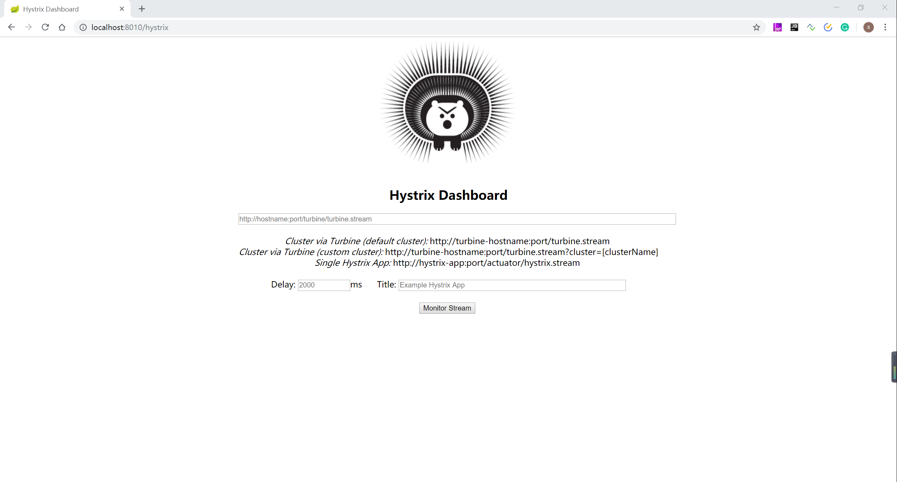

# SpringCloud学习笔记之服务容错保护Hystrix.md

## 前言

在分布式架构中，当某个服务单元发生故障之后，通过断路器的故障监控，向调用方法返回一个错误响应，而不是长时间的等待。这样就不会使得线程因调用故障服务被长时间占用不释放，避免了故障在分布式系统中的蔓延。

Hystrix 具备服务降级、服务熔断、线程和信号隔离、请求缓存、请求合并以及服务监控等强大功能。

## 快速入门

断路器在客户端配置（消费者）

### pom.xml 依赖

```xml
<?xml version="1.0" encoding="UTF-8"?>
<project xmlns="http://maven.apache.org/POM/4.0.0"
         xmlns:xsi="http://www.w3.org/2001/XMLSchema-instance"
         xsi:schemaLocation="http://maven.apache.org/POM/4.0.0 http://maven.apache.org/xsd/maven-4.0.0.xsd">
    <modelVersion>4.0.0</modelVersion>

    <groupId>top.simba1949</groupId>
    <artifactId>spring-cloud-hystrix-consumer</artifactId>
    <version>1.0-SNAPSHOT</version>

    <parent>
        <groupId>org.springframework.boot</groupId>
        <artifactId>spring-boot-starter-parent</artifactId>
        <version>2.1.5.RELEASE</version>
        <relativePath /> <!-- lookup parent from repository -->
    </parent>

    <dependencyManagement>
        <dependencies>
            <dependency>
                <groupId>org.springframework.cloud</groupId>
                <artifactId>spring-cloud-dependencies</artifactId>
                <version>Greenwich.RELEASE</version>
                <type>pom</type>
                <scope>import</scope>
            </dependency>
        </dependencies>
    </dependencyManagement>

    <dependencies>
        <!--spring boot starter : Core starter, including auto-configuration support, logging and YAML-->
        <dependency>
            <groupId>org.springframework.boot</groupId>
            <artifactId>spring-boot-starter</artifactId>
        </dependency>
        <!--spring boot starter test : Starter for testing Spring Boot applications with libraries including JUnit, Hamcrest and Mockito-->
        <dependency>
            <groupId>org.springframework.boot</groupId>
            <artifactId>spring-boot-starter-test</artifactId>
            <scope>test</scope>
        </dependency>
        <!--spring boot starter actuator:
            Starter for using Spring Boot’s Actuator which provides production ready features to help you monitor and manage your application
        -->
        <dependency>
            <groupId>org.springframework.boot</groupId>
            <artifactId>spring-boot-starter-actuator</artifactId>
        </dependency>
        <dependency>
            <groupId>org.springframework.boot</groupId>
            <artifactId>spring-boot-devtools</artifactId>
            <optional>true</optional>
        </dependency>
        <dependency>
            <groupId>org.projectlombok</groupId>
            <artifactId>lombok</artifactId>
        </dependency>
        <!--spring boot starter web : Starter for building web, including RestFul, applications using Spring MVC. Uses Tomcat as the default embedded container-->
        <dependency>
            <groupId>org.springframework.boot</groupId>
            <artifactId>spring-boot-starter-web</artifactId>
        </dependency>

        <dependency>
            <groupId>org.springframework.cloud</groupId>
            <artifactId>spring-cloud-starter-netflix-eureka-client</artifactId>
        </dependency>
        <dependency>
            <groupId>org.springframework.cloud</groupId>
            <artifactId>spring-cloud-starter-netflix-ribbon</artifactId>
        </dependency>
        <!-- hystrix dependency -->
        <dependency>
            <groupId>org.springframework.cloud</groupId>
            <artifactId>spring-cloud-starter-netflix-hystrix</artifactId>
        </dependency>

    </dependencies>

    <build>
        <plugins>
            <!--编译插件-->
            <plugin>
                <groupId>org.apache.maven.plugins</groupId>
                <artifactId>maven-compiler-plugin</artifactId>
                <configuration>
                    <!-- 配置使用的 jdk 版本 -->
                    <target>1.8</target>
                    <source>1.8</source>
                </configuration>
            </plugin>
            <!--springboot-maven打包插件 和 热部署配置-->
            <plugin>
                <groupId>org.springframework.boot</groupId>
                <artifactId>spring-boot-maven-plugin</artifactId>
                <configuration>
                    <fork>true</fork> <!-- 如果没有该配置，devtools不会生效 -->
                    <executable>true</executable><!--将项目注册到linux服务上，可以通过命令开启、关闭以及伴随开机启动等功能-->
                </configuration>
            </plugin>
            <!--资源拷贝插件-->
            <plugin>
                <groupId>org.apache.maven.plugins</groupId>
                <artifactId>maven-resources-plugin</artifactId>
                <configuration>
                    <encoding>UTF-8</encoding>
                </configuration>
            </plugin>
        </plugins>
        <!--IDEA是不会编译src的java目录的xml文件，如果需要读取，则需要手动指定哪些配置文件需要读取-->
        <resources>
            <resource>
                <directory>src/main/java</directory>
                <includes>
                    <include>**/*.xml</include>
                </includes>
            </resource>
            <resource>
                <directory>src/main/resources</directory>
                <includes>
                    <include>**/*</include>
                </includes>
            </resource>
        </resources>
    </build>
</project>
```

### application.properties

**注意：hystrix 可能会出现服务能够调用成功但是还会调用熔断回调方法，配置熔断时间即可**

```properties
server.port=7000
spring.application.name=spring-cloud-hystrix-consumer

eureka.instance.hostname=localhost
eureka.client.service-url.defaultZone=http://${eureka.instance.hostname}:8081/eureka
# hystrix 可能会出现服务能够调用成功但是还会调用熔断回调方法，这里需要配置熔断时间
hystrix.command.default.execution.isolation.thread.timeoutInMilliseconds=10000

logging.level.root=debug
```

### Ribbon 配置类

```java
package top.simba1949.config;

import org.springframework.cloud.client.loadbalancer.LoadBalanced;
import org.springframework.context.annotation.Bean;
import org.springframework.context.annotation.Configuration;
import org.springframework.web.client.RestTemplate;

/**
 * @author SIMBA1949
 * @date 2019/7/13 20:07
 */
@Configuration
public class RibbonConfig {

    @Bean
    @LoadBalanced
    public RestTemplate restTemplate(){
        return new RestTemplate();
    }
}
```

### 请求服务类

```java
package top.simba1949.service;

import com.netflix.hystrix.contrib.javanica.annotation.HystrixCommand;
import org.springframework.beans.factory.annotation.Autowired;
import org.springframework.http.ResponseEntity;
import org.springframework.stereotype.Service;
import org.springframework.web.client.RestTemplate;

/**
 * @author SIMBA1949
 * @date 2019/7/13 20:51
 */
@Service
public class HelloService {
    private static final String SERVICE_NAME = "http://SPRING-CLOUD-HYSTRIX-PROVIDER";
    @Autowired
    private RestTemplate restTemplate;

    @HystrixCommand(fallbackMethod = "sayFallback")
    public String say(String name) {
        ResponseEntity<String> resp = restTemplate.getForEntity(SERVICE_NAME + "/hello/" + name, String.class);
        String body = resp.getBody();
        return body;
    }

    /**
	 * 异常处理/熔断处理 需要添加 Throwable 对象来接收异常信息
	 *
	 * @param name
	 * @param e
	 * @return
	 */
    public String sayFallback(String name, Throwable e){
        return "Dear " + name +", This is error result : " + e.getMessage();
    }
}
```

### 控制层

```java
package top.simba1949.controller;

import org.springframework.beans.factory.annotation.Autowired;
import org.springframework.web.bind.annotation.GetMapping;
import org.springframework.web.bind.annotation.PathVariable;
import org.springframework.web.bind.annotation.RequestMapping;
import org.springframework.web.bind.annotation.RestController;
import top.simba1949.service.HelloService;

/**
 * @author SIMBA1949
 * @date 2019/7/13 20:05
 */
@RestController
@RequestMapping("hello")
public class HelloController {

    @Autowired
    private HelloService helloService;

    @GetMapping("{name}")
    public String say(@PathVariable(value = "name")String name){
        String result = helloService.say(name);
        return result;
    }
}
```

### 启动类

```java
package top.simba1949;

import org.springframework.boot.SpringApplication;
import org.springframework.boot.autoconfigure.SpringBootApplication;
import org.springframework.cloud.client.discovery.EnableDiscoveryClient;
import org.springframework.cloud.netflix.hystrix.EnableHystrix;

/**
 * @EnableHystrix 开启断路器功能
 *
 * @author SIMBA1949
 * @date 2019/7/13 19:45
 */
@EnableHystrix
@EnableDiscoveryClient
@SpringBootApplication
public class Application {
    public static void main(String[] args) {
        SpringApplication.run(Application.class, args);
    }
}
```

## Hystrix Dashboard 仪表盘

Hystrix Dashboard 主要用于实时监控 Hystrix 的各项指标信息。通过 Hystrix Dashboard 反馈的实时信息，可以帮助我们快速发现系统存在的问题，从而及时的采取措施。

Hystrix Dashboard 共支持三种不同的监控方式

1. 默认的集群监控：通过 URL http://turbine-hostname:port/turbine.stream 开启，实现对默认集群的监控
2. 指定的集群监控：通过 URL http://turbine-hostname:port/turbine.stream?cluster=[clusterName] 开启，实现对 clusterName 集群的监控
3. 单体应用的监控：通过 URL http://hystrix-app:port/hystrix.stream 开启，实现对具体的某个服务实例的监控

1 和 2 都是对集群的监控，需要整合 Turbine 才能实现

### 单体应用的监控 Hystrix Dashboard

#### 重要依赖

```xml
<dependency>
    <groupId>org.springframework.boot</groupId>
    <artifactId>spring-boot-starter-actuator</artifactId>
</dependency>
<dependency>
    <groupId>org.springframework.cloud</groupId>
    <artifactId>spring-cloud-starter-netflix-hystrix</artifactId>
</dependency>
<dependency>
    <groupId>org.springframework.cloud</groupId>
    <artifactId>spring-cloud-starter-netflix-hystrix-dashboard</artifactId>
</dependency>
```

#### pom.xml 依赖

```xml
<?xml version="1.0" encoding="UTF-8"?>
<project xmlns="http://maven.apache.org/POM/4.0.0"
         xmlns:xsi="http://www.w3.org/2001/XMLSchema-instance"
         xsi:schemaLocation="http://maven.apache.org/POM/4.0.0 http://maven.apache.org/xsd/maven-4.0.0.xsd">
    <modelVersion>4.0.0</modelVersion>

    <groupId>top.simba1949</groupId>
    <artifactId>spring-cloud-hystrix-dashboard</artifactId>
    <version>1.0-SNAPSHOT</version>

    <parent>
        <groupId>org.springframework.boot</groupId>
        <artifactId>spring-boot-starter-parent</artifactId>
        <version>2.1.5.RELEASE</version>
        <relativePath /> <!-- lookup parent from repository -->
    </parent>

    <dependencyManagement>
        <dependencies>
            <dependency>
                <groupId>org.springframework.cloud</groupId>
                <artifactId>spring-cloud-dependencies</artifactId>
                <version>Greenwich.RELEASE</version>
                <type>pom</type>
                <scope>import</scope>
            </dependency>
        </dependencies>
    </dependencyManagement>

    <dependencies>
        <!--spring boot starter : Core starter, including auto-configuration support, logging and YAML-->
        <dependency>
            <groupId>org.springframework.boot</groupId>
            <artifactId>spring-boot-starter</artifactId>
        </dependency>
        <!--spring boot starter test : Starter for testing Spring Boot applications with libraries including JUnit, Hamcrest and Mockito-->
        <dependency>
            <groupId>org.springframework.boot</groupId>
            <artifactId>spring-boot-starter-test</artifactId>
            <scope>test</scope>
        </dependency>
        <dependency>
            <groupId>org.springframework.boot</groupId>
            <artifactId>spring-boot-devtools</artifactId>
            <optional>true</optional>
        </dependency>
        <dependency>
            <groupId>org.projectlombok</groupId>
            <artifactId>lombok</artifactId>
        </dependency>
        <!--spring boot starter web : Starter for building web, including RestFul, applications using Spring MVC. Uses Tomcat as the default embedded container-->
        <dependency>
            <groupId>org.springframework.boot</groupId>
            <artifactId>spring-boot-starter-web</artifactId>
        </dependency>


        <!--spring boot starter actuator:
            Starter for using Spring Boot’s Actuator which provides production ready features to help you monitor and manage your application
        -->
        <dependency>
            <groupId>org.springframework.boot</groupId>
            <artifactId>spring-boot-starter-actuator</artifactId>
        </dependency>
        <!-- https://mvnrepository.com/artifact/org.springframework.cloud/spring-cloud-starter-netflix-hystrix -->
        <dependency>
            <groupId>org.springframework.cloud</groupId>
            <artifactId>spring-cloud-starter-netflix-hystrix</artifactId>
        </dependency>
        <!-- https://mvnrepository.com/artifact/org.springframework.cloud/spring-cloud-starter-netflix-hystrix-dashboard -->
        <dependency>
            <groupId>org.springframework.cloud</groupId>
            <artifactId>spring-cloud-starter-netflix-hystrix-dashboard</artifactId>
        </dependency>
    </dependencies>

    <build>
        <plugins>
            <!--编译插件-->
            <plugin>
                <groupId>org.apache.maven.plugins</groupId>
                <artifactId>maven-compiler-plugin</artifactId>
                <configuration>
                    <!-- 配置使用的 jdk 版本 -->
                    <target>1.8</target>
                    <source>1.8</source>
                </configuration>
            </plugin>
            <!--springboot-maven打包插件 和 热部署配置-->
            <plugin>
                <groupId>org.springframework.boot</groupId>
                <artifactId>spring-boot-maven-plugin</artifactId>
                <configuration>
                    <fork>true</fork> <!-- 如果没有该配置，devtools不会生效 -->
                    <executable>true</executable><!--将项目注册到linux服务上，可以通过命令开启、关闭以及伴随开机启动等功能-->
                </configuration>
            </plugin>
            <!--资源拷贝插件-->
            <plugin>
                <groupId>org.apache.maven.plugins</groupId>
                <artifactId>maven-resources-plugin</artifactId>
                <configuration>
                    <encoding>UTF-8</encoding>
                </configuration>
            </plugin>
        </plugins>
        <!--IDEA是不会编译src的java目录的xml文件，如果需要读取，则需要手动指定哪些配置文件需要读取-->
        <resources>
            <resource>
                <directory>src/main/java</directory>
                <includes>
                    <include>**/*.xml</include>
                </includes>
            </resource>
            <resource>
                <directory>src/main/resources</directory>
                <includes>
                    <include>**/*</include>
                </includes>
            </resource>
        </resources>
    </build>
</project>
```

#### 启动类

```java
package top.simba1949;

import org.springframework.boot.SpringApplication;
import org.springframework.boot.autoconfigure.SpringBootApplication;
import org.springframework.cloud.netflix.hystrix.dashboard.EnableHystrixDashboard;

/**
 * @EnableHystrixDashboard 开启监控面板
 * 
 * @author SIMBA1949
 * @date 2019/7/18 22:05
 */
@EnableHystrixDashboard
@SpringBootApplication
public class Application {
    public static void main(String[] args) {
        SpringApplication.run(Application.class, args);
    }
}
```

#### 配置文件

```properties
server.port=8010
spring.application.name=spring-cloud-hystrix-dashboard
# 释放 hystrix.stream 端点
management.endpoints.web.exposure.include=hystrix.stream
# 可以注册到 eureka 中，示例没有注册到 eureka
```

#### 访问测试

访问 http:// IP:PORT/hystrix



#### 在 Hystrix Dashboard 查看三种方式

```
# 1
Cluster via Turbine (default cluster): http://turbine-hostname:port/turbine.stream 
# 2
Cluster via Turbine (custom cluster): http://turbine-hostname:port/turbine.stream?cluster=[clusterName]
# 3
Single Hystrix App: http://hystrix-app:port/actuator/hystrix.stream 
```

#### 问题及解决方案

```
# 问题一：Unable to connect to Command Metric Stream
需要在配置文件释放 hystrix.stream 端点，即在配置文件添加如下
management.endpoints.web.exposure.include=hystrix.stream

# 问题二：如果页面一直  loading 或者访问 http://IP:PORT/hystrix.stream 一直 ping
需要至少访问一次 @HystrixCommand 修饰的URL
```

### 使用 Turbine 聚合监控数据


